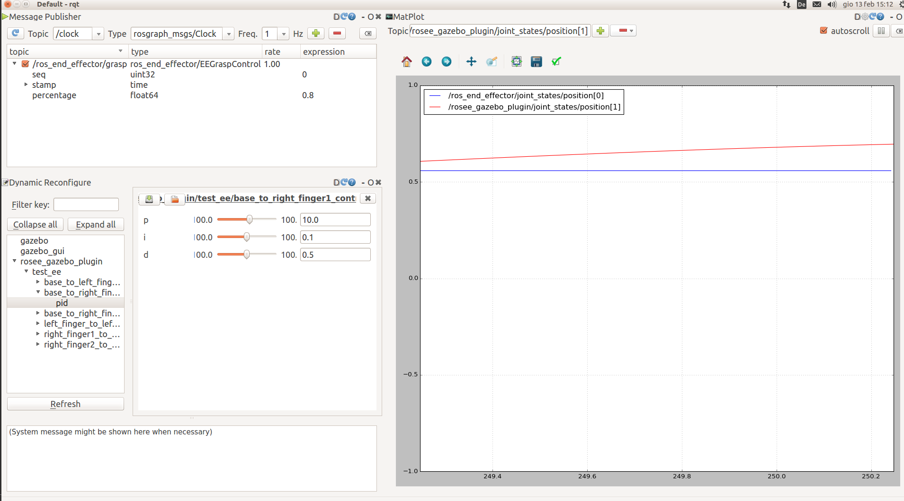

# rosee_gazebo_plugins
#### Utility package to simulate robot in gazebo for [ROSEE](https://github.com/ADVRHumanoids/ROSEndEffector) project
*****
It is very similar to the "official" ROS package for control : [gazebo_ros_control](http://gazebosim.org/tutorials/?tut=ros_control)

It includes a gazebo plugin to take commands (*references*) from */ros_end_effector/joint_states* topic and use to move the simulated robot in gazebo. The same plugin also publish the "real" joint States (derived by the gazebo simulation) in the topic */rosee_gazebo_plugin/joint_states*.  
**Take care:** In */ros_end_effector/joint_states* topic there are state for only some joints (and never for not actuated ones); while in */rosee_gazebo_plugin/joint_states* there are state for ALL joints, always, included fixed and not actuated. Gazebo do not have a "getActuatedJoint" function from the model parsed.


At the moment each joint can be commanded in position or in velocity, using the *SetPositionTarget()* and *SetVelocityTarget()* of gazebo. Gains (pid) are settable in a config file (see later for istructions)

There is also a ROS node, *rosee_gazebo_plugin_DynReconfigure* which create *dynamic_reconfigure* servers to give the possibility to change the PID params during the simulation.

## How to Run
#### Examples
```bash
roslaunch rosee_gazebo_plugins twofinger.launch
# or roslaunch rosee_gazebo_plugins testEE.launch
```
#### To run the dynamic reconfigurator:
```bash
rosrun rosee_gazebo_plugins DynReconfigure two_finger
# or rosrun rosee_gazebo_plugins DynReconfigure test_ee
```
#### Also useful
```bash
rqt
```
And set it to have things like that, for example to tune the gains: 
<p align="center">

</p>

### How to run with your model
* Be sure to have an urdf file ready for gazebo [info](http://gazebosim.org/tutorials/?tut=ros_urdf) 
    Also add in your urdf :
    ```xml
    <gazebo>
        <plugin name="SOMENAME" filename="librosee_plugin.so"> </plugin>
    </gazebo>
    ```
* Create new *YOURROBOTNAME_control.yaml* file in *configs* folder, following the examples present there. Note that supported controllers *type* are *JointPositionController* and *JointVelocityController*
* Create Launch file similar to the ones present in *launch* folder changing the name when necessary:
  ```xml
   <!-- load yaml for controllers -->
    <rosparam param="rosee_gazebo_plugin" file="$(find rosee_gazebo_plugins)/configs/YOURROBOTNAME_control.yaml" />
    
    <!-- Spawn a robot into Gazebo   -->
    <node name="spawn_urdf" pkg="gazebo_ros" type="spawn_model" 
        args="-file $(find rosee_gazebo_plugins)/configs/urdf/YOURROBOTNAME.urdf -urdf -z 1 -model test_ee" />
    ```
* launch your new launch file and have fun 

### Change more params with Dynamic Reconfigurator
* Check the ros tutorials about that ( [here](http://wiki.ros.org/dynamic_reconfigure/Tutorials) ) 
* Add (or extend) config files in *cfg* folder
* Check the DynReconfigure code

